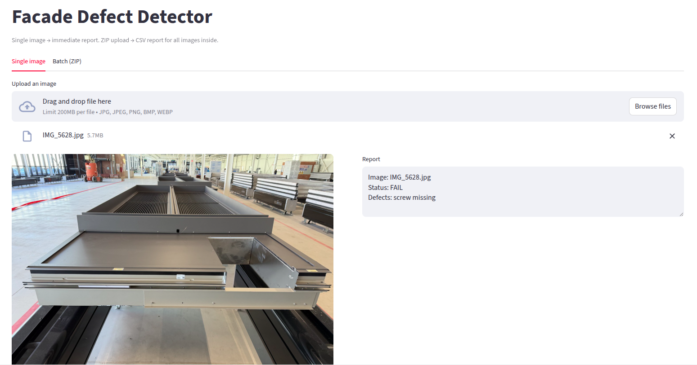
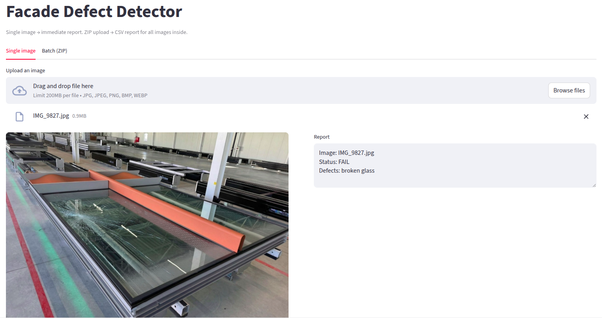
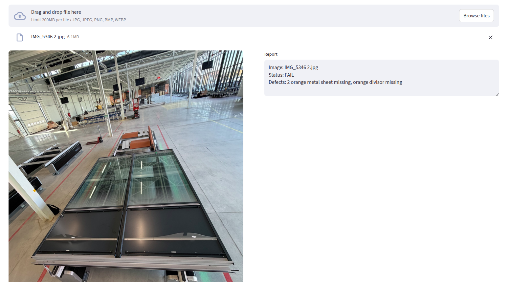

# Automated Quality Control of Facade Elements

## Intro / Context / Problem

**KFK** (Krov, Fasada, Konstrukcija) is a European leader in aluminum and glass facade systems.  
Each facade element must pass a quality control (QC) step before installation. Today, this process is manual: a worker visually inspects each element and compares it against specifications. This approach is slow, error-prone, and expensive—missed defects are often discovered only on-site, where repair or replacement costs are extremely high.

This project was developed during **NeoData Hackathon 2025**, organized by **Comminus**, with the goal of exploring an automated, scalable computer vision solution for defect detection on facade elements.

---

## Approach / Solution

### 1. Dataset Exploration
We started by thoroughly exploring the provided dataset and available 3D models of facade elements.  
The first step was manual inspection of images to understand:
- Typical appearance of correct (positive) elements  
- Common defect patterns in defective (negative) elements  
- Variability in lighting, viewpoints, and background clutter  

This step was crucial since the dataset contained **no predefined defect annotations**.

---

### 2. Early Experiments and Key Insight
We initially explored **SAM3** (Segment Anything Model v3) to directly localize defects. While SAM3 showed promising qualitative results, its performance was inconsistent without additional structural context.

This led to a key conclusion:
> **Defect detection is significantly easier if the facade element type is known first.**

The dataset contains **three distinct facade element types**, each with different geometry and defect characteristics.

---

### 3. Macro Idea (Final System Design)
We defined the following high-level pipeline:

1. **Detect and classify the facade element** in the image  
2. **Apply a specialized defect-detection strategy** tailored to that specific facade element type  

This allowed us to trade a single, generic defect detector for **multiple precise, domain-specific methods**.

---

### 4. Dataset Limitations and Synthetic Data Exploration
The main challenge was the **small size of the real dataset**.  
We explored generating a synthetic dataset using the provided **3D models** by rendering realistic images with controlled defects. Although conceptually strong, this approach proved too time-consuming to implement robustly within the 24-hour hackathon.

As a practical compromise, we:
- Applied image rotations and simple augmentations  
- Balanced classes to stabilize training  

---

### 5. Facade Element Detection (YOLO)
We trained a **YOLO-based object detection model** to classify the facade element type.

- Primary metric: **accuracy**  
- Rationale: downstream defect detection depends entirely on correct element classification  

This model acts as the entry point to the pipeline.

---

### 6. Defect Detection (SAM3 + Heuristics)
After classification, we applied **element-specific defect detection strategies**, combining:
- Carefully designed **SAM3 prompts**
- Geometry- and context-aware post-processing  

Here, **precision** was the dominant metric:  
false positives are costly in QC and directly penalized in evaluation.

---

### 7. Explored but Dropped: 3D–2D Alignment
We also investigated aligning the ideal **3D model** with the **2D image** to detect deviations as defects.  
While promising for long-term industrial deployment, accurate 3D–2D alignment exceeded the scope of a 24-hour hackathon and was therefore dropped.

---

### 8. Productization
To make the solution usable, we implemented a **simple Streamlit UI** that:
- Accepts a single image or a batch of images  
- Runs the full pipeline  
- Generates a clear QC report per image  

---

## Why Now

KFK is actively expanding its **Data Science and automation efforts**.  
This solution demonstrates a scalable path toward:
- Reducing manual QC costs  
- Improving consistency and reliability  
- Laying foundations for future data-driven quality assurance systems  

The approach is modular and can evolve with more data and tighter integration of 3D models.

---

## Product Demo

The final solution is wrapped in a lightweight **Streamlit application** designed for fast and intuitive QC inspection.

The app supports:
- **Single-image analysis** – upload one image and receive an immediate QC decision and defect report  
- **Batch analysis** – upload a `.zip` archive of images and automatically generate a consolidated report for all elements  

For each image, the application:
- Predicts the facade element type  
- Runs the corresponding defect-detection pipeline  
- Generates a structured QC report (PASS / FAIL with detected defects)  
- **Visually highlights selected defects** directly on the image for easier interpretation  

The demo includes screenshots of example usage for both single-image and batch workflows.

### Demo Screenshots

---

## Long-Term Vision

Although not fully implemented during the hackathon, **3D-model-based synthetic data generation** remains a highly promising direction.  
With sufficient time, this approach could enable:
- Large, realistic training datasets  
- Controlled simulation of rare defects  
- Strong generalization across projects and configurations  

---

## Team

- **Marin Meštrović** – Student, PMF (Graduate Program in Computer Science)  
- **Damjan Crnković** – Student, FER  
- **Luka Bubnjević** – Student, FER